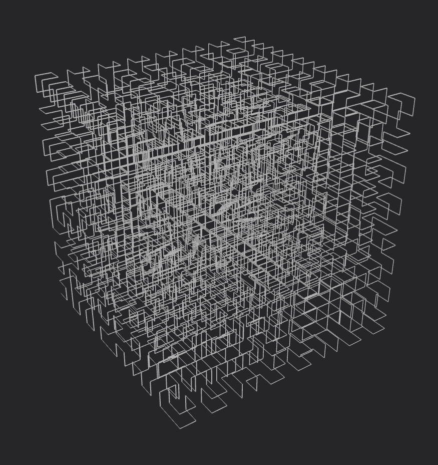

# HSFC-Generator

A WIP Hilbert Space-Filling Curve generator with a built-in OBJ generator for rendering the curves

Intended for use as a library, but contains a main.rs file with example usage.

## Project Structure:

### [Hilbert-Curve](./src/crates/hilbert-curve)

This module contains functionality for generating the Cartesian coordinates of the vertices in a Hilbert Space-Filling Curve in both 2D and 3D.

It also contains utility functions for converting the output vertices into different formats:

- (x,y,z) in binary
- (x,y,z) in decimal

### [Linear-Path](./src/crates/linear-path)

This module contains functionality for generating OBJ files from the cartesian coordinates of a Hilbert Curve.

These are useful for visualizing the output of the Hilbert Curve generator, and can be readily rendered by uploading to an online OBJ file renderer.

## Examples:

### n2, p2

### n3, p2

### n=2, p=4

### n=3, p=4

